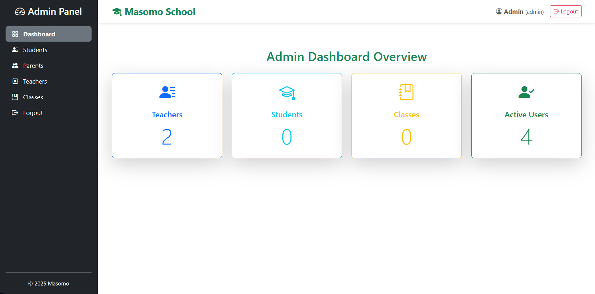
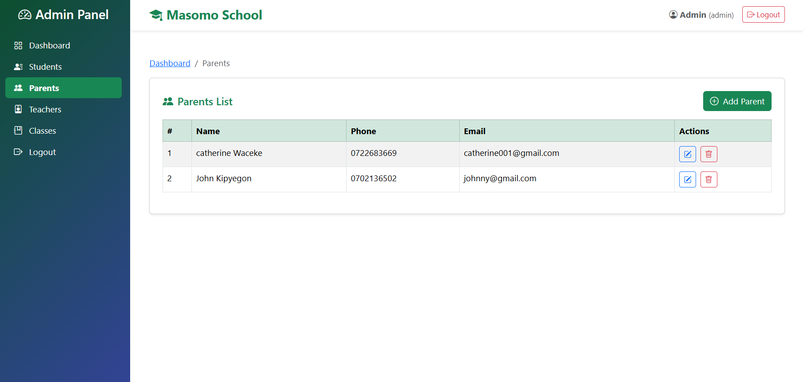
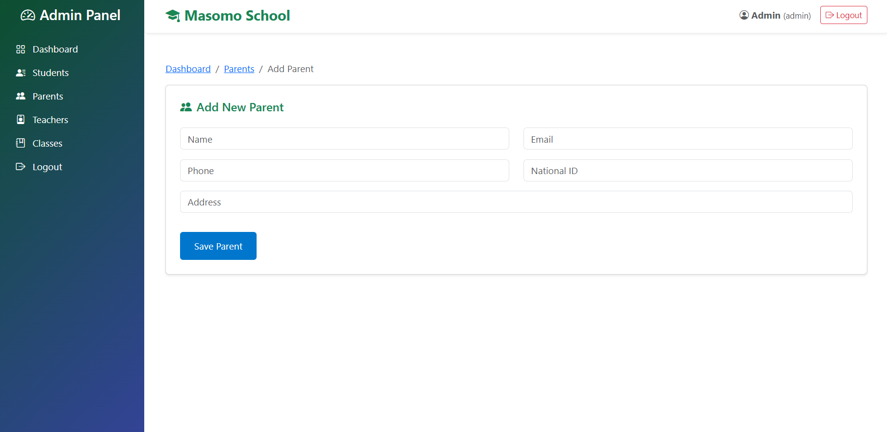
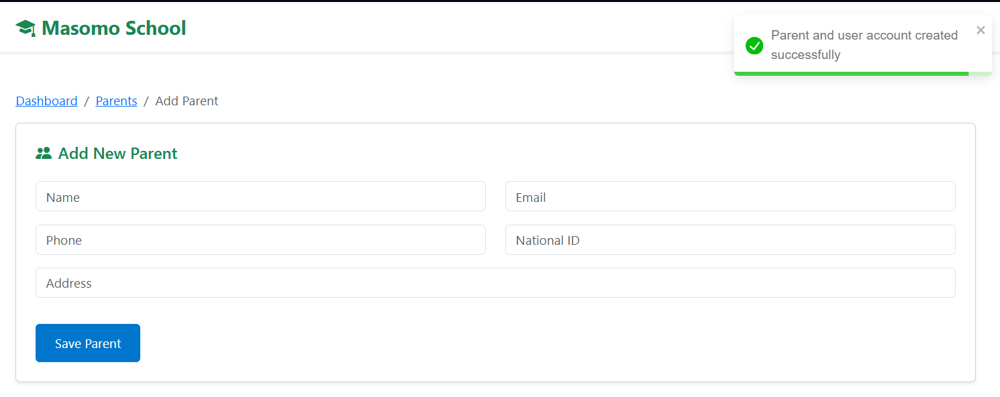
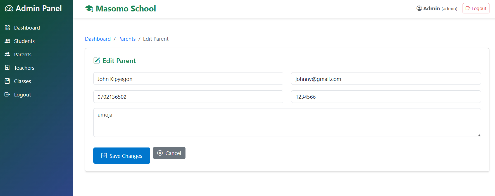

# 🏫 Masomo School Management System (React + Node + Express)

This project is a **school management system** built using **React** for the frontend and **Node.js/Express** for the backend. It features:

- ✅ Role-based login
- 🔒 Protected admin dashboard
- 📂 Separate views for Admin, Teachers, and Parents

---

## 📁 Project Structure Overview


## 🧱 Step 1: Initialize the Project

1. Create a new React project and install required dependencies:

npx create-react-app@latest masomo-school
cd masomo-school

npm install axios react-router-dom bootstrap jwt-decode


## 🌐 Step 2: Create the Landing Page – HomeComponent
📄 File: src/components/HomeComponent.jsx
Create a simple home/landing page visible to all users.


## 🧾 Step 3: Register Component – RegisterComponent


📄 File: `src/components/RegisterComponent.jsx`

```javascript
import React, { useState } from 'react';
import { Link, useNavigate } from 'react-router-dom';
import axios from 'axios';

const RegisterComponent = () => {
  const [name, setName] = useState('');
  const [email, setEmail] = useState('');
  const [password, setPassword] = useState('');
  const [secretKey, setSecretKey] = useState('');
  const [error, setError] = useState('');
  const [success, setSuccess] = useState('');
  const [loading, setLoading] = useState('');

  const navigate = useNavigate();
  const url = 'http://localhost:3000/api/login/admin_reg';

  const handleSubmit = async (e) => {
    e.preventDefault();
    setError('');
    setSuccess('');
    setLoading('Registering Admin Account...');

    try {
      const data = { name, email, password, secretKey };
      const res = await axios.post(url, data);

      console.log("registratio success:", res.data);

      setLoading('');
      setSuccess('Registration successful! Redirecting to login...');
      
      alert('Registration successful! You will be redirected to login.');
      navigate('/login');

    } catch (err) {
      setLoading('');
      setError('Registration failed. Please try again.');
    }
  };

  return (
    <div className="container mt-5" style={{ maxWidth: '500px' }}>
      <form onSubmit={handleSubmit} className="shadow card p-4 bg-light rounded">
        <h1 className="text-center text-success">Masomo School</h1>
        <h2 className="text-center mb-4 text-success">Register</h2>

        {error ? <div className="alert alert-danger">{error}</div> : null}
        {success ? <div className="alert alert-success">{success}</div> : null}
        {loading ? <div className="alert alert-info">{loading}</div> : null}

        <input
          type="text"
          className="form-control mb-3"
          placeholder="Full Name"
          value={name}
          onChange={(e) => setName(e.target.value)}
          required
        />

        <input
          type="email"
          className="form-control mb-3"
          placeholder="Email Address"
          value={email}
          onChange={(e) => setEmail(e.target.value)}
          required
        />

        <input
          type="password"
          className="form-control mb-3"
          placeholder="Password"
          value={password}
          onChange={(e) => setPassword(e.target.value)}
          required
        />

        <input
          type="text"
          className="form-control mb-3"
          placeholder="Secret Key"
          value={secretKey}
          onChange={(e) => setSecretKey(e.target.value)}
          required
        />

        <div className="d-grid mb-3">
          <button type="submit" className="btn btn-success">Register</button>
        </div>

        <div className="text-center">
          <p>
            Already have an account?{' '}
            <Link to="/login" className="text-decoration-none">Login here</Link>
          </p>
        </div>
      </form>
    </div>
  );
};

export default RegisterComponent;
```

## 🧾 Step 4: Login Component – LoginComponent


📄 File: `src/components/LoginComponent.jsx`

```jsx
import React, { useContext, useState } from 'react';
import { Link, useNavigate } from 'react-router-dom';
import axios from 'axios';
import { AuthContext } from '../context/AuthContext';

const LoginComponent = () => {
  const [email, setEmail] = useState('');
  const [password, setPassword] = useState('');
  const [error, setError] = useState('');
  const [loading, setLoading] = useState('');
  const navigate = useNavigate();
    //from context get the function to change the state of token and user   
  const {setToken,setUser}=useContext(AuthContext)

  const url = "http://localhost:3000/api/login/";

  const handleSubmit = async (e) => {
    e.preventDefault();
    setError('');
    setLoading('Logging in...');

    try {
        const data = { email, password };
        const res = await axios.post(url, data);

        const { token, user } = res.data;

        // Store token and user info in localStorage
        localStorage.setItem('token', token);
        localStorage.setItem('user', JSON.stringify(user));

        // console.log("Login success:", message);
        setToken(token)
        setUser(user)


        // Role-based redirection
        if (user.role === 'admin') {
        navigate('/admin-dashboard');
        } else if (user.role === 'teacher') {
        navigate('/teacher-dashboard');
        } else if (user.role === 'parent') {
        navigate('/parent-dashboard');
        } else {
        navigate('/'); 
        }

    } catch (error) {
        console.log(error)
      setLoading('');
      setError('Login failed. Please try again.');
    }
  };

  return (
    <div className="container mt-5" style={{ maxWidth: '500px' }}>
      <form onSubmit={handleSubmit} className="shadow card p-4 bg-light rounded">
        <h1 className="text-center text-success">Masomo School</h1>
        <h2 className="text-center mb-4 text-success">Login</h2>

        {error ? <div className="alert alert-danger">{error}</div> : null}
        {loading ? <div className="alert alert-info">{loading}</div> : null}

        <input
          type="email"
          className="form-control mb-3 mt-3"
          placeholder="Enter your email"
          value={email}
          onChange={(e) => setEmail(e.target.value)}
          required
        />

        <input
          type="password"
          className="form-control mb-3"
          placeholder="Enter your password"
          value={password}
          onChange={(e) => setPassword(e.target.value)}
          required
        />

        <div className="d-grid mb-3">
          <button type="submit" className="btn btn-success">Login</button>
        </div>

        <div className="text-center">
          <p>
            Don't have an account?{' '}
            <Link to="/register" className="text-decoration-none">Register here</Link>
          </p>
        </div>
      </form>
    </div>
  );
};

export default LoginComponent;


```

### 🔐 Step 5: Why Context is Needed

Context is used because after login, the state needs to persist globally, and React alone doesn’t remember authentication unless it’s passed through context.

📄 **Create Context File:** `src/context/AuthContext.jsx`

```jsx
import { jwtDecode } from 'jwt-decode';
import React, { createContext, useState, useEffect, useCallback } from 'react';
import { useNavigate } from 'react-router-dom';

const AuthContext = createContext();

const AuthProvider = ({ children }) => {
    const navigate = useNavigate(); 

    // Initialize state from localStorage
    const [token, setToken] = useState(() => localStorage.getItem('token') || '');
    const [user, setUser] = useState(() => JSON.parse(localStorage.getItem('user') || 'null'));

    // Logout function using a callback
    const logout = useCallback(() => {
        localStorage.clear();
        setToken('');
        setUser(null);
        navigate('/login'); 
    }, [navigate]);

    // Check if the token is expired
    useEffect(() => {
        if (token) {
            try {
                const decoded = jwtDecode(token);
                const isExpired = decoded.exp * 1000 < Date.now();

                if (isExpired) {
                    logout();
                }
            } catch (error) {
                logout();
            }
        }
    }, [token, logout]);

    return (
        <AuthContext.Provider value={{ token, user, logout, setToken, setUser }}>
            {children}
        </AuthContext.Provider>
    );
};

export { AuthContext, AuthProvider };

```


### 🔐 Step 5: Protecting Routes with ProtectedRoute Component
To restrict access to certain routes based on the user’s role, we need to create a ProtectedRoute component. This component will check if the user is logged in and whether they have the required role to access a particular page. If not, they will be redirected to either the login page or a "Not Authorized" page.

**📄 File: `src/components/ProtectedRoute.jsx`

``` jsx
import React, { useContext } from 'react';
import { Navigate } from 'react-router-dom';
import { AuthContext } from './AuthContext'; // adjust path if needed

const ProtectedRoute = ({ allowedRoles, children }) => {
  const { user } = useContext(AuthContext);

  if (!user) {
    // Not logged in
    return <Navigate to="/login" replace />;
  }

  if (!allowedRoles.includes(user.role)) {
    // Role not allowed
    return <Navigate to="/not-authorized" replace />;
  }

  return children;
};

export default ProtectedRoute;

```

How It Works:
Login Check: The component first checks if the user is logged in by looking at the user object from the AuthContext. If no user is found, the component redirects the user to the /login page.

Role-Based Check: If the user is logged in but their role doesn't match the allowedRoles array, they are redirected to a /not-authorized page.

Children Rendering: If the user is logged in and has the correct role, it renders the children components (the protected content).

### 🔐 Step 6: Protecting Routes implementation

```jsx
// import logo from './logo.svg';
import './App.css';
import 'bootstrap/dist/css/bootstrap.min.css';
import 'bootstrap-icons/font/bootstrap-icons.css';
import 'bootstrap/dist/js/bootstrap.min.js';
import { BrowserRouter as Router, Routes, Route } from "react-router-dom";
import HomeComponent from './components/HomeComponent';
import LoginComponent from './components/LoginComponent';
import NotFound from './components/NotFound';
import NotAuthorized from './components/NotAuthorized';
import RegisterComponent from './components/RegisterComponent';
import { AuthProvider } from './context/AuthContext';
import ProtectedRoute from './context/ProtectedRoute';
import AdminLayout from './components/admin/AdminLayout';
import Teachers from './components/admin/Teachers';
import Parents from './components/admin/Parents';
import Classes from './components/admin/Classes';
import Student from './components/admin/Student';
import AdminDashboard from './components/admin/AdminDashboard';


function App() {
  return (
    <Router>
      <AuthProvider>
        <div className="App">
          <header className="App-header">
          </header>
        </div>
        <Routes>
            <Route path='/' element={<HomeComponent/>}/>

            {/* Admin Protected Routes */}
            <Route path='/admin-dashboard' 
                element={
                  <ProtectedRoute allowedRoles={['admin']}>
                    <AdminLayout/>
                  </ProtectedRoute>
                }>
                <Route path='' element={<AdminDashboard />} />
                <Route path='teachers' element={<Teachers />} />
                <Route path='parents' element={<Parents />} />
                <Route path='students' element={<Student />} />
                <Route path='classes' element={<Classes />} />
            </Route>
            
            <Route path='/login' element={<LoginComponent/>}/>
            <Route path='/register' element={<RegisterComponent/>}/>

            {/* defaults */}
            <Route path='/not-authorized' element={<NotAuthorized/>}/>
            <Route path='*' element={<NotFound/>}/>
        </Routes>
      </AuthProvider>
    </Router>
  );
}

export default App;
```
### 🔐 Step 7: Admin Components which includes the sidebar, navbar and main area
the below image shows the dashboard


### 🔐 Step 8: Sidebar 
```jsx
import React from 'react';
import { NavLink } from 'react-router-dom';

const SideBar = () => {
  return (
    <div className="bg-dark text-white d-flex flex-column p-3" style={{ minHeight: '100vh', width: '250px' }}>
      <h4 className="text-center mb-4">
        <i className="bi bi-speedometer2 me-2"></i>Admin Panel
      </h4>
      <ul className="nav nav-pills flex-column mb-auto">
        <li className="nav-item">
          <NavLink
            to="/admin-dashboard"
            end
            className={({ isActive }) =>
              isActive ? 'nav-link bg-secondary text-white fw-bold' : 'nav-link text-white'
            }
          >
            <i className="bi bi-grid me-2"></i> Dashboard
          </NavLink>
        </li>

        <li>
          <NavLink
            to="/admin-dashboard/students"
            className={({ isActive }) =>
              isActive ? 'nav-link bg-secondary text-white fw-bold' : 'nav-link text-white'
            }
          >
            <i className="bi bi-person-lines-fill me-2"></i> Students
          </NavLink>
        </li>

        <li>
          <NavLink
            to="/admin-dashboard/parents"
            className={({ isActive }) =>
              isActive ? 'nav-link bg-secondary text-white fw-bold' : 'nav-link text-white'
            }
          >
            <i className="bi bi-people-fill me-2"></i> Parents
          </NavLink>
        </li>

        <li>
          <NavLink
            to="/admin-dashboard/teachers"
            className={({ isActive }) =>
              isActive ? 'nav-link bg-secondary text-white fw-bold' : 'nav-link text-white'
            }
          >
            <i className="bi bi-person-badge me-2"></i> Teachers
          </NavLink>
        </li>

        <li>
          <NavLink
            to="/admin-dashboard/classes"
            className={({ isActive }) =>
              isActive ? 'nav-link bg-secondary text-white fw-bold' : 'nav-link text-white'
            }
          >
            <i className="bi bi-journal-bookmark me-2"></i> Classes
          </NavLink>
        </li>

        <li>
          <NavLink
            to="/"
            className={({ isActive }) =>
              isActive ? 'nav-link bg-danger text-white fw-bold' : 'nav-link text-white'
            }
          >
            <i className="bi bi-box-arrow-right me-2"></i> Logout
          </NavLink>
        </li>
      </ul>

      <hr />
      <div className="text-center small">
        <span className="text-light">© 2025 Masomo</span>
      </div>
    </div>
  );
};

export default SideBar;
```

### 🔐 Step 9: Navbar
```jsx
import React, { useContext } from 'react';
import { AuthContext } from '../context/AuthContext';
import 'bootstrap-icons/font/bootstrap-icons.css';

const DashboardNavbar = () => {
  // get the logged in user and the logout function using useContect hook from AuthContext
  const { user, logout } = useContext(AuthContext);

  return (
    <nav className="navbar navbar-expand-lg bg-white shadow-sm px-4 py-2 mb-3 rounded">
      <div className="container-fluid d-flex justify-content-between align-items-center">
        <span className="navbar-brand fw-bold text-success fs-4">
          <i className="bi bi-mortarboard-fill me-2"></i>
          Masomo School
        </span>

        <div className="d-flex align-items-center">
          <span className="me-3 text-muted">
            <i className="bi bi-person-circle me-1"></i>
            <strong>{user?.name}</strong> <small className="text-muted">({user?.role})</small>
          </span>

          <button className="btn btn-sm btn-outline-danger d-flex align-items-center" onClick={logout}>
            <i className="bi bi-box-arrow-right me-1"></i> Logout
          </button>
        </div>
      </div>
    </nav>
  );
};

export default DashboardNavbar;

```

### 🔐 Step 10: Admin Layout  
Outlet from router is used to show the child components dynamically
```jsx
  import React from 'react';
  import { Outlet } from 'react-router-dom';
  import DashboardNavbar from '../DashboardNavbar';
  import SideBar from './SideBar';

  const AdminLayout = () => {
    return (
      <div className="d-flex">
        <SideBar />

        <div className="flex-grow-1">
          <DashboardNavbar /> 

          {/* Main area where the routed page content will be displayed */}
          <main className="p-4">
            {/* Outlet renders the matched child route’s element */}
            <Outlet />
          </main>
        </div>
      </div>
    );
  };

  export default AdminLayout;

```

### Step 11: Parent Component  -List



```jsx
  import React, { useEffect, useState, useContext } from 'react';
import axios from 'axios';
import { Link, useNavigate } from 'react-router-dom';
import { AuthContext } from '../../context/AuthContext';
// remeber to install react-toastify
import { toast, ToastContainer } from 'react-toastify';
import 'react-toastify/dist/ReactToastify.css';

const Parents = () => {
  const [parents, setParents] = useState([]);
  const { token } = useContext(AuthContext);
  const navigate = useNavigate();
  
  // Authorization header for secure API requests
  const authHeader = {
    headers: { Authorization: `Bearer ${token}` },
  };

  const fetchParents = async () => {
    try {
      toast.info('Loading parents...')
      const res = await axios.get('http://localhost:3000/api/parents/', authHeader);

      setParents(res.data);
      toast.dismiss()
    } catch (err) {
      toast.dismiss();
      toast.error(err.response?.data?.message)
    }
  };

  useEffect(() => {
    fetchParents();
  }, []);
    
  const handleDelete = async (id) => {
    if (window.confirm('Delete this parent?')) {
      try {
        toast.warning('deleting parent...')
        await axios.delete(`http://localhost:3000/api/parents/${id}`, authHeader);
        
        fetchParents();
      } catch (err) {
        toast.dismiss();
        toast.error(err.response?.data?.message || 'Error deleting parent')
      }
    }
  };

  const handleEdit = (parent) => {
    navigate('/admin-dashboard/parent-edit', { state: { parent } });
  };

  return (
    <div className="container mt-2">
      {/* Toasts */}
        <ToastContainer position="top-right" autoClose={3000} />

      {/* Breadcrumbs */}
      <nav aria-label="breadcrumb" className="mb-3">
        <ol className="breadcrumb">
          <li className="breadcrumb-item"><Link to="/admin-dashboard">Dashboard</Link></li>
          <li className="breadcrumb-item active" aria-current="page">Parents</li>
        </ol>
      </nav>
      
      {/* card for parents */}
      <div className="card p-4 shadow-sm">
        <div className="d-flex justify-content-between align-items-center mb-3">
          <h5 className="text-success mb-0">
            <i className="bi bi-people-fill me-2"></i>
            Parents List
          </h5>
          <button
              className="btn btn-success"
              onClick={() => navigate('/admin-dashboard/parents-add')}
            >
            <i className="bi bi-plus-circle me-2"></i>
            Add Parent
          </button>
        </div>

        {/* table */}
        <div className="table-responsive"> 
          {/* checking there is a parent */}
          {parents.length === 0 ? (
            <div className="alert alert-warning text-center mb-0">
              <i className="bi bi-exclamation-circle me-2"></i>
              No parents found.
            </div>
            ) : (
              <table className="table table-striped table-hover table-bordered">
                <thead className="table-success">
                  <tr>
                    <th>#</th>
                    <th>Name</th>
                    <th>Phone</th>
                    <th>Email</th>
                    <th>Actions</th>
                  </tr>
                </thead>
                <tbody>
                {/* mapping */}
                  {parents.map((p, index) => (
                    <tr key={p._id}>
                      <td>{index + 1}</td>
                      <td>{p.name}</td>
                      <td>{p.phone}</td>
                      <td>{p.email}</td>
                      <td>
                        <button
                          className="btn btn-sm btn-outline-primary me-2"
                          onClick={() => handleEdit(p)}
                        >
                          <i className="bi bi-pencil-square"></i>
                        </button>
                        <button
                          className="btn btn-sm btn-outline-danger"
                          onClick={() => handleDelete(p._id)}
                        >
                          <i className="bi bi-trash"></i>
                        </button>
                      </td>
                    </tr>
                  ))}
                </tbody>
              </table>
          )}
        </div>
      </div>  
    </div>
  );
};

export default Parents;

```

### Step 11: Parent Component  -ParentAdd component



```jsx
import React, { useState, useContext } from 'react';
import axios from 'axios';
import { AuthContext } from '../../../context/AuthContext';
import { Link } from 'react-router-dom';
// remember to install react-toastify
import { toast, ToastContainer } from 'react-toastify';
import 'react-toastify/dist/ReactToastify.css';

const ParentAdd = () => {
  const { token } = useContext(AuthContext);

  const [name, setName] = useState('');
  const [email, setEmail] = useState('');
  const [phone, setPhone] = useState('');
  const [nationalId, setNationalId] = useState('');
  const [address, setAddress] = useState('');

  // Authorization header for secure API requests  
  const authHeader = {
    headers: { Authorization: `Bearer ${token}` }
  };

  const handleSubmit = async (e) => {
    e.preventDefault();
    // data json body
    const data = { name, email, phone, nationalId, address };

    try {
      toast.info('Submitting...');
      const res = await axios.post('http://localhost:3000/api/parents/', data, authHeader);

      toast.dismiss();
      toast.success(res.data.message || 'Parent added successfully!');

      // Optionally clear form
      setName('');
      setEmail('');
      setPhone('');
      setNationalId('');
      setAddress('');
    } catch (err) {
      toast.dismiss();
      toast.error(err.response?.data?.message || 'Error submitting form');
    }
  };

  return (
    <div className="container mt-2">
      {/* Toasts */}
      <ToastContainer position="top-right" autoClose={5000} />

      {/* Breadcrumbs */}
      <nav aria-label="breadcrumb" className="mb-3">
        <ol className="breadcrumb">
          <li className="breadcrumb-item"><Link to="/admin-dashboard">Dashboard</Link></li>
          <li className="breadcrumb-item"><Link to="/admin-dashboard/parents">Parents</Link></li>
          <li className="breadcrumb-item active" aria-current="page">Add Parent</li>
        </ol>
      </nav>

      <div className="card p-4 shadow-sm mb-4">
        <h5 className="mb-4 text-success">
          <span className="bi bi-people-fill me-2 text-success"></span>
          Add New Parent
        </h5>

        <form onSubmit={handleSubmit}>
          <div className="row">
            <div className="col-md-6 mb-3">
              <input
                type="text"
                className="form-control"
                placeholder="Name"
                value={name}
                onChange={(e) => setName(e.target.value)}
                required
              />
            </div>

            <div className="col-md-6 mb-3">
              <input
                type="email"
                className="form-control"
                placeholder="Email"
                value={email}
                onChange={(e) => setEmail(e.target.value)}
                required
              />
            </div>

            <div className="col-md-6 mb-3">
              <input
                type="text"
                className="form-control"
                placeholder="Phone"
                value={phone}
                onChange={(e) => setPhone(e.target.value)}
                required
              />
            </div>

            <div className="col-md-6 mb-3">
              <input
                type="text"
                className="form-control"
                placeholder="National ID"
                value={nationalId}
                onChange={(e) => setNationalId(e.target.value)}
                required
              />
            </div>

            <div className="col-12 mb-3">
              <input
                type="text"
                className="form-control"
                placeholder="Address"
                value={address}
                onChange={(e) => setAddress(e.target.value)}
                required
              />
            </div>
          </div>

          <button type="submit" className="btn btn-primary">
            Save Parent
          </button>
        </form>
      </div>
    </div>
  );
};

export default ParentAdd;


```

### Step 12: Parent Component  -ParentEdit component


```jsx
import React, { useState, useContext, useEffect } from 'react';
import axios from 'axios';
import { Link, useNavigate, useLocation } from 'react-router-dom';
import { toast, ToastContainer } from 'react-toastify';
import 'react-toastify/dist/ReactToastify.css';
import { AuthContext } from '../../../context/AuthContext';

const ParentEdit = () => {    
    // Declare state variables for the parent's details
    const [name, setName] = useState('');
    const [email, setEmail] = useState('');
    const [phone, setPhone] = useState('');
    const [nationalId, setNationalId] = useState('');
    const [address, setAddress] = useState('');


    const { token } = useContext(AuthContext);
    const navigate = useNavigate();

    //To receive data passed from the previous route  
    const { state } = useLocation();
    const parent = state?.parent;
    
    // Load initial data when the component mounts
    useEffect(() => {
        if (!parent) {
        toast.error("No parent data provided");

        // For programmatically navigating the user
        navigate("/admin-dashboard/parents");
        return
        }
    
    // Set the form fields with the existing parent data
    setName(parent.name || '');
    setEmail(parent.email || '');
    setPhone(parent.phone || '');
    setNationalId(parent.nationalId || '');
    setAddress(parent.address || '');
  }, [parent, navigate]);

  // Authorization header for secure API requests
  const authHeader = {
    headers: { Authorization: `Bearer ${token}` }
  };

  // on submit this function triggers   
  const handleSubmit = async (e) => {
    e.preventDefault();
    const data = { name, email, phone, nationalId, address };

    try {
      toast.info('Updating...');
      // Send PUT request to update parent data
      const res = await axios.put(`http://localhost:3000/api/parents/${parent._id}`,data,authHeader);
      toast.dismiss();
      toast.success(res.data.message || 'Parent updated successfully!');
      navigate('/admin-dashboard/parents');
    } catch (err) {
      toast.dismiss();
      toast.error(err.response?.data?.message);
    }
  };

  return (
    <div className="container mt-2">
      <ToastContainer position="top-right" autoClose={5000} />

      <nav aria-label="breadcrumb" className="mb-3">
        <ol className="breadcrumb">
          <li className="breadcrumb-item"><Link to="/admin-dashboard">Dashboard</Link></li>
          <li className="breadcrumb-item"><Link to="/admin-dashboard/parents">Parents</Link></li>
          <li className="breadcrumb-item active" aria-current="page">Edit Parent</li>
        </ol>
      </nav>

      <div className="card p-4 shadow-sm mb-4">
        <h5 className="mb-4 text-success">
          <span className="bi bi-pencil-square me-2 text-success"></span>
          Edit Parent
        </h5>

        <form onSubmit={handleSubmit}>
          <div className="row">
            <div className="col-md-6 mb-3">
              <input
                type="text"
                className="form-control"
                placeholder="Name"
                value={name}
                onChange={(e) => setName(e.target.value)}
                required
              />
            </div>

            <div className="col-md-6 mb-3">
              <input
                type="email"
                className="form-control"
                placeholder="Email"
                value={email}
                onChange={(e) => setEmail(e.target.value)}
                required
              />
            </div>

            <div className="col-md-6 mb-3">
              <input
                type="text"
                className="form-control"
                placeholder="Phone"
                value={phone}
                onChange={(e) => setPhone(e.target.value)}
                required
              />
            </div>

            <div className="col-md-6 mb-3">
              <input
                type="text"
                className="form-control"
                placeholder="National ID"
                value={nationalId}
                onChange={(e) => setNationalId(e.target.value)}
                required
              />
            </div>

            <div className="col-12 mb-3">
              <textarea
                className="form-control"
                placeholder="Address"
                value={address}
                onChange={(e) => setAddress(e.target.value)}
                rows="3"
                required
              />
            </div>

            <div className="col-12">
                <button type="submit" className="btn btn-primary me-2">
                    <i className="bi bi-save me-1"></i> Save Changes
                </button>
                
                <Link to="/admin-dashboard/parents" className="btn btn-secondary">
                    <i className="bi bi-x-circle me-1"></i> Cancel
                </Link>
            </div>

          </div>
        </form>
      </div>
    </div>
  );
};

export default ParentEdit;

```
