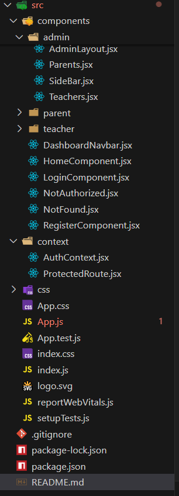

# 🏫 Masomo School Management System (React + Node + Express)

This project is a **school management system** built using **React** for the frontend and **Node.js/Express** for the backend. It features:

- ✅ Role-based login
- 🔒 Protected admin dashboard
- 📂 Separate views for Admin, Teachers, and Parents

---

## 📁 Project Structure Overview




## 🧱 Step 1: Initialize the Project

1. Create a new React project and install required dependencies:

npx create-react-app@latest masomo-school
cd masomo-school

npm install axios react-router-dom bootstrap jwt-decode


## 🌐 Step 2: Create the Landing Page – HomeComponent
📄 File: src/components/HomeComponent.jsx
Create a simple home/landing page visible to all users.


## 🧾 Step 3: Register Component – RegisterComponent
📄 File: src/components/RegisterComponent.jsx

```import React, { useState } from 'react';
import { Link, useNavigate } from 'react-router-dom';
import axios from 'axios';

const RegisterComponent = () => {
  const [name, setName] = useState('');
  const [email, setEmail] = useState('');
  const [password, setPassword] = useState('');
  const [secretKey, setSecretKey] = useState('');
  const [error, setError] = useState('');
  const [success, setSuccess] = useState('');
  const [loading, setLoading] = useState('');

  const navigate = useNavigate();
  const url = 'http://localhost:3000/api/login/admin_reg';

  const handleSubmit = async (e) => {
    e.preventDefault();
    setError('');
    setSuccess('');
    setLoading('Registering Admin Account...');

    try {
      const data = { name, email, password, secretKey };
      const res = await axios.post(url, data);

      console.log("registratio success:", res.data);

      setLoading('');
      setSuccess('Registration successful! Redirecting to login...');
      
      alert('Registration successful! You will be redirected to login.');
      navigate('/login');

    } catch (err) {
      setLoading('');
      setError('Registration failed. Please try again.');
    }
  };

  return (
    <div className="container mt-5" style={{ maxWidth: '500px' }}>
      <form onSubmit={handleSubmit} className="shadow card p-4 bg-light rounded">
        <h1 className="text-center text-success">Masomo School</h1>
        <h2 className="text-center mb-4 text-success">Register</h2>

        {error ? <div className="alert alert-danger">{error}</div> : null}
        {success ? <div className="alert alert-success">{success}</div> : null}
        {loading ? <div className="alert alert-info">{loading}</div> : null}

        <input
          type="text"
          className="form-control mb-3"
          placeholder="Full Name"
          value={name}
          onChange={(e) => setName(e.target.value)}
          required
        />

        <input
          type="email"
          className="form-control mb-3"
          placeholder="Email Address"
          value={email}
          onChange={(e) => setEmail(e.target.value)}
          required
        />

        <input
          type="password"
          className="form-control mb-3"
          placeholder="Password"
          value={password}
          onChange={(e) => setPassword(e.target.value)}
          required
        />

        <input
          type="text"
          className="form-control mb-3"
          placeholder="Secret Key"
          value={secretKey}
          onChange={(e) => setSecretKey(e.target.value)}
          required
        />

        <div className="d-grid mb-3">
          <button type="submit" className="btn btn-success">Register</button>
        </div>

        <div className="text-center">
          <p>
            Already have an account?{' '}
            <Link to="/login" className="text-decoration-none">Login here</Link>
          </p>
        </div>
      </form>
    </div>
  );
};

export default RegisterComponent;```

### 🔐 Step 4: Why Context is Needed
Context is used because after login, the state needs to persist globally, and React alone doesn’t remember authentication unless it’s passed through context.

📄 Create Context File: src/context/AuthContext.jsx
```import { jwtDecode } from 'jwt-decode';
import React, { createContext, useState, useEffect, useCallback } from 'react';
import { useNavigate } from 'react-router-dom';

const AuthContext = createContext();

const AuthProvider = ({ children }) => {
    const navigate = useNavigate(); 

    // Initialize state from localStorage
    const [token, setToken] = useState(() => localStorage.getItem('token') || '');
    const [user, setUser] = useState(() =>JSON.parse(localStorage.getItem('user') || 'null'))


    // logout function//using a callback
    const logout = useCallback(() => {
        localStorage.clear();
        setToken('');
        setUser(null);
        navigate('/login'); 
    }, [navigate]);

    // check if the token is expired
    useEffect(() => {
        if (token) {
            try {
                const decoded = jwtDecode(token);
                const isExpired = decoded.exp * 1000 < Date.now();

                if (isExpired) {
                    // console.log("Token expired, logging out.");
                    logout();
                }
            } catch (error) {
                // console.log("Invalid token format.");
                logout();
            }
        }
    }, [token, logout]);

  return (
    <AuthContext.Provider value={{ token, user, logout,setToken,setUser }}>
      {children}
    </AuthContext.Provider>
  );
};

export {AuthContext,AuthProvider}```

